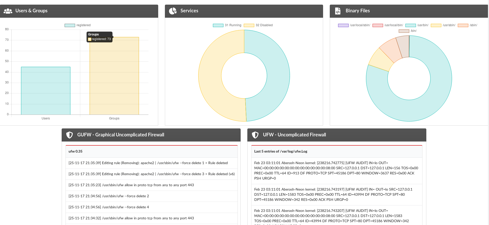

# remote KDE made with Symfony 4
Remote control your Linux KDE Desktop through a web-based interface made in Symfony 4

## Getting Started
coming soon.
### Prerequisites
coming soon.
### Installing
coming soon.
## Built With
* [Symfony 4](https://symfony.com/4)
* [Twig](https://twig.symfony.com/)
* [Semantic UI](https://semantic-ui.com/)
* [Charts.js](http://www.chartjs.org/)
* [JQuery](https://jquery.com/)
## Authors
Sayid Sam-Sin
https://github.com/S-Sam-Sin
## License
This project is licensed under the MIT License - see the [LICENSE.md](/LICENSE) file for details
